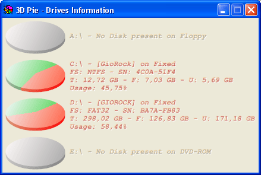



## A 3D Pie Drives Information

### Description

Show all drives information by 3D Pie blending color graphical mode.

Display Path, Volume, Serial Number, Type, FileSystem, Total - Free -

Used spaces and percentage of usage for all attached device.

Note: this version uses GDI plus to obtain maximum rendering possible

to draw images and antialias text.

All Colors can easyly customized using a Colors enumerator included

into code.

Correct just a little bug in routine DrawGraph to prevent 100% usage is

displayed how 101%.

Please don't forget to vote, I'm working hard for this project.

Using GDI+ can be "deletery" offering too many infinite possibility to

manipulate graphics device.

Special thanks for all to have publicated some GDI+ samples.
 
### More Info
 

             |
---                |---
**Submitted On**   |2009-02-13 23:52:44
**By**             |[GioRock](https://github.com/Planet-Source-Code/PSCIndex/blob/master/ByAuthor/giorock.md)
**Level**          |Advanced
**User Rating**    |4.7 (66 globes from 14 users)
**Compatibility**  |VB 6\.0
**Category**       |[Windows System Services](https://github.com/Planet-Source-Code/PSCIndex/blob/master/ByCategory/windows-system-services__1-35.md)
**World**          |[Visual Basic](https://github.com/Planet-Source-Code/PSCIndex/blob/master/ByWorld/visual-basic.md)
**Archive File**   |[A\_3D\_Pie\_D2143942152009\.zip](https://github.com/Planet-Source-Code/giorock-a-3d-pie-drives-information__1-71710/archive/master.zip)

